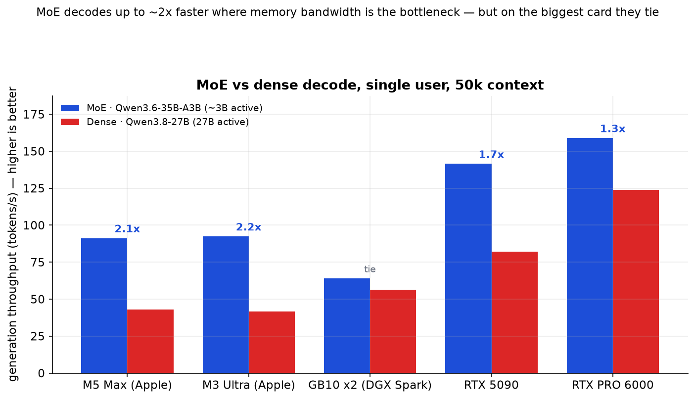
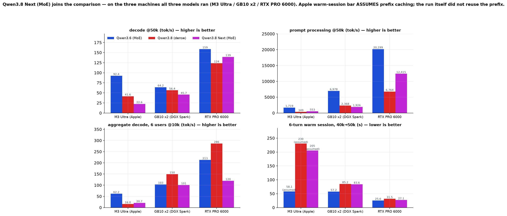
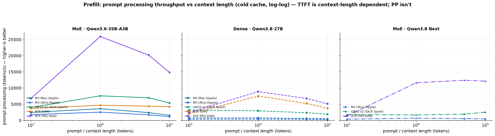
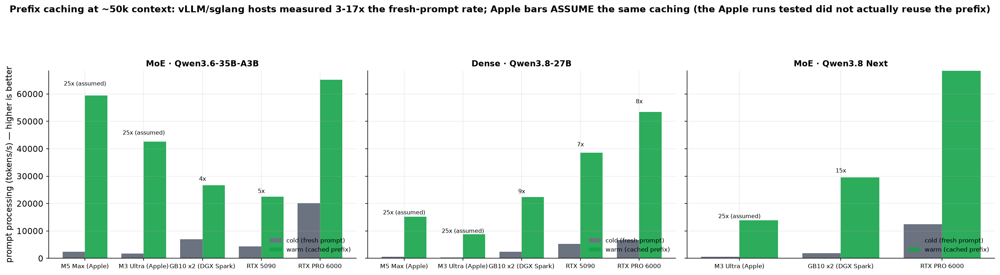
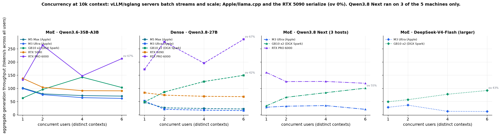
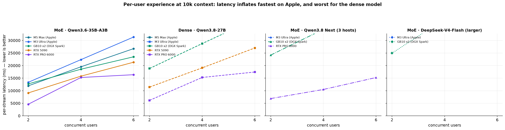
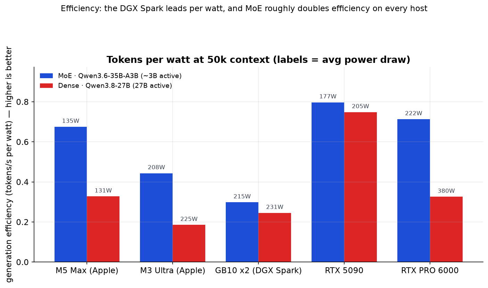
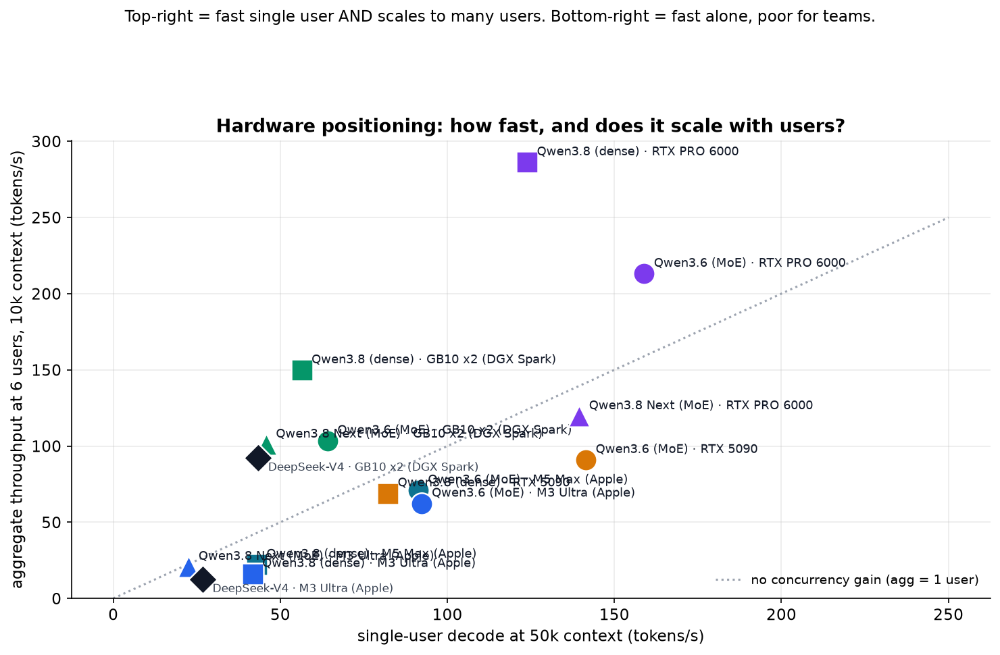

# Local-LLM hardware: what's actually worth it, and for whom

_Cross-scenario analysis of `results/` — a small MoE vs a dense model vs a
mid-sized MoE (plus a larger-MoE reference), concurrency, context length & caching across 5 machines and 4
models. General benchmarks: cold prefill/decode across 1k–200k context, prefix
caching, and multi-user concurrency. Coding/agentic sessions are one angle
(mostly warm-cache) — not the whole story._

Generated 2026-09-07 — now including **Qwen3.8 Next** (scenario
`qwen3.8-next`, 3 machines). Charts in `analysis/charts/` (see [The charts](#the-charts)).
**Interactive walkthrough:** open `analysis/site/index.html` in a browser (self-contained —
vendored Plotly, no internet needed) for a model/host toggleable version of this story,
with Qwen3.8 Next as a fourth model in the selector.

---

## The gist

This report answers five questions with measured data, not speculation:

1. **MoE vs dense** — does a mixture-of-experts model beat a dense model of similar size, and *where*?
2. **Concurrency** — what happens when 2/4/6 users hit the same box at once?
3. **Context length & cache** — how does prefill cost grow with context, and how much does prefix caching help?
4. **The new model** — where does Qwen3.8 Next fit, and does it change any of the answers above?
   (Yes, twice: it is the best big-context model on the workstation GPU, and it *broke* the
   "vLLM batches" generalisation on that same card. See
   [Qwen3.8 Next joins the table](#1b-qwen38-next-joins-the-table).)
5. **Bottom line** — which hardware to buy for which situation.

### The comparison is apples-to-apples

Two model families ran the *same workload* (512 output tokens, same context
lengths, same multi-user plan) on the *same five machines*; the third model ran
that same workload on three of them:

| architecture | model | total params | active params | quants on each host | hosts |
|---|---|---|---|---|---|
| **MoE** | Qwen3.6-35B-A3B | 35B | ~3B | MLX 8-bit (Apple), FP8/NVFP4 (NVIDIA) | all 5 |
| **Dense** | Qwen3.8-27B | 27B | 27B | MLX 4-bit (Apple), NVFP4 (NVIDIA) | all 5 |
| **MoE** (size not recorded) | Qwen3.8 Next | not recorded | not recorded | GGUF Q8_0 (Apple), NVFP4 (vLLM), sglang build (DGX) | **3 of 5** |

A secondary data point — **DeepSeek-V4-Flash**, a much larger MoE (284B total,
13B active) — ran on `gx10-top` and `macstudio` and is shown as a reference on
the verdict map.

> **What is, and isn't, recorded for Qwen3.8 Next.** It is a MoE — the second one
> in this report, and the servers advertise it under its full name
> `Qwen3.8-Flash-Next`. What the run artifact keeps is only what those servers
> expose: model id (`Qwen3.8-Flash-Next-GGUF` Q8_0 on the Mac under Unsloth
> Studio/llama.cpp, `primitive-ai/Qwen3.8-Flash-Next-NVFP4` under vLLM,
> `qwen3.8-flash-next` under sglang) and a 262,144-token context cap. No total
> parameter count, no active-expert count. So every claim about it below is
> behavioural — it is compared against the 3B-active MoE and the 27B dense as
> measured, and sized from timings rather than from a datasheet.

| host | hardware class | chip / GPU | peak mem BW (ref) |
|---|---|---|---|
| `m5-max` | Apple laptop | Apple M5 Max (40-core GPU) | ~614 GB/s |
| `macstudio` | Apple workstation | Apple M3 Ultra | ~819 GB/s |
| `gx10-top` | NVIDIA DGX Spark (2-node) | 2 × GB10 | ~273 GB/s each |
| `tr-pro-5090` | Consumer GPU | GeForce RTX 5090 | ~1792 GB/s |
| `tr-pro-6000` | Workstation GPU | RTX PRO 6000 | ~1792 GB/s |

`macstudio`, `gx10-top` and `tr-pro-6000` are the three machines that also ran
Qwen3.8 Next; `m5-max` and `tr-pro-5090` were deliberately left out of that
scenario, so it has no bars there rather than missing ones.

> **Data caveats.** (1) These are single runs; concurrent batches were run once,
> so individual cells wobble (batch noise, not a trend).
> (2) Power readings for very short requests (1k, and on one card 10k too) often
> miss the 2 s sampling window, so all efficiency figures below use the
> **50k-context** runs (6 s to 3 min long — solidly sampled). A window that reads
> at the run's *idle floor* while the box was demonstrably busy is now treated as
> unmeasured rather than divided through (the dcgm exporter pinned an RTX PRO
> 6000 at 18 W / 0 % util for the first ~10 s of a run while it streamed
> 148 tok/s), which is why a couple of cells in §5 are absent instead of absurd.
> (3) **Caching revision:** the omlx instances serving Qwen3.6/Qwen3.8 in these
> runs did *not* reuse the prefix (warm PP ≈ cold PP), which is a server-config
> shortfall — DeepSeek cached on the same Mac, and an earlier run did too. All
> **Apple warm-session / team numbers in this report are revised to assume
> vLLM-equivalent prefix caching** (turn 1 = full prefill, later turns = new tail
> only); cold and multi-user-cold numbers are untouched — see
> [Does it remember what you already pasted?](#3-does-it-remember-what-you-already-pasted).
> Qwen3.8 Next on the Mac (llama.cpp/GGUF, a *different* backend) shows the
> same shortfall — measured warm/cold = 0.98x — so it is revised on the same basis.
> (4) Multi-user throughput uses the overlap-based aggregation
> (`bench/results.py:concurrent_batch_aggregates`): it measures the window where
> all streams decode together, falling back to the achieved (serialized) rate
> where streams never overlap. `ov 0%` usually means the server queued requests
> (Apple/MLX, RTX 5090 — verified against raw timestamps), but on a few
> `gx10-top`/Qwen3.6 cells it means the strict all-stream intersection was empty
> due to skewed prefills; both cases report the conservative union rate.
> Existing `results/*/report/` artifacts predate this change; `analysis/` is
> generated with the overlap method.
> (5) **Qwen3.8 Next specifics:** one complete run per machine (the Qwen
> figures are run-averaged, so its decode carries full single-run noise), a
> different server per machine, and 8-bit weights on the Mac where the Qwen rows
> are 4-bit — read its cross-machine rows as *model + backend + quant* together.

---

## 1. Does MoE beat dense — and where?

**The headline chart** — single-user generation throughput at 50k context:



| host | MoE (tok/s) | Dense (tok/s) | MoE advantage |
|---|---|---|---|
| M3 Ultra (Apple) | 92.4 | 41.6 | **2.2x** |
| M5 Max (Apple) | 91.3 | 42.9 | **2.1x** |
| RTX 5090 | 141.5 | 82.2 | **1.7x** |
| GB10 ×2 (DGX Spark) | 64.2 | 56.4 | **1.1x** |
| RTX PRO 6000 | 158.9 | 123.9 | **1.3x** |

**Why.** Generation (decode) is memory-bandwidth-bound: every output token
streams the active weights through memory. A 3B-active MoE moves a fraction of
the bytes a 27B dense model does — so on bandwidth-hungry machines (Apple
unified memory, consumer GPUs) it is dramatically faster. But the RTX PRO 6000
has so much bandwidth (1792 GB/s) that the dense 27B model is no longer the
bottleneck — the MoE advantage evaporates to a tie. **The card's biggest asset
(killer bandwidth) is exactly what erases MoE's structural advantage.**

MoE also wins big on *prefill* — prompt processing throughput (PP, prompt
tokens/s; TTFT alone isn't comparable because context lengths differ) is far
higher on most hosts, because it computes ~3B params instead of 27B:

| host | MoE PP @50k | Dense PP @50k | MoE advantage |
|---|---|---|---|
| M3 Ultra | 1,719 tok/s | 349 | **4.9x** |
| M5 Max | 2,401 | 601 | **4.0x** |
| GB10 ×2 | 6,978 | 2,368 | **2.9x** |
| RTX PRO 6000 | 20,199 | 6,764 | **3.0x** |
| RTX 5090 | 4,406 | 5,244 | 0.8x (dense ahead) |

> For a 27–35B-class model, **MoE is the better bet on Apple silicon and the
> DGX Spark** (2–5x faster prefill, 1.4–2.1x faster decode). On the top
> workstation GPU the two architectures converge.

---

## 1b. Qwen3.8 Next joins the table

*(Added 2026-09-07 — one run per machine, on the three machines that ran it:*
*M3 Ultra, GB10 ×2, RTX PRO 6000.)*



| metric | M3 Ultra (Apple) | GB10 ×2 (DGX Spark) | RTX PRO 6000 |
|---|---|---|---|
| decode @50k — MoE Qwen3.6 | 92.4 tok/s | 64.2 | 158.9 |
| decode @50k — dense Qwen3.8 | 41.6 | 56.4 | 123.9 |
| **decode @50k — Qwen3.8 Next** | **22.6** | **45.7** | **139.5** |
| prefill @50k — MoE | 1,719 tok/s | 6,978 | 20,199 |
| prefill @50k — dense | 349 | 2,368 | 6,764 |
| **prefill @50k — Qwen3.8 Next** | **553** | **1,926** | **12,415** |
| 6-turn warm session — MoE | 58.1 s | 57.2 s | 25.6 s |
| 6-turn warm session — dense | 230.1 s | 85.2 s | 31.5 s |
| **6-turn warm session — Qwen3.8 Next** | **205.2 s** | **83.6 s** | **27.1 s** |

**1. It is a big-NVIDIA, small-Apple model.** On the RTX PRO 6000 it lands
within 12% of the MoE on decode (139.5 vs 158.9) and *ahead* of the dense 27B
(1.13x), with a 27.1 s session — effectively PRO-6000-class speed. On the M3
Ultra it has the slowest decode of the four models in this report at every
context length but one (22.6 tok/s at 50k against 41.6 dense and 92.4 MoE; 12.4
tok/s at 200k where even DeepSeek manages 23.8) — the single exception is 10k,
where it ties DeepSeek-V4 (28.8 vs 28.6). **Do not read that Apple column as a
pure model effect** — it is an 8-bit GGUF model under llama.cpp/Unsloth Studio
where the Qwen rows are 4-bit MLX under omlx; model, backend and quant all move
together there. Its *prefill* on the Mac is actually ahead of the dense model's
(553 vs 349 tok/s @50k), so it doesn't behave like "just another dense model"
either — which is roughly what you'd expect of a MoE whose active size sits
between the 3B-active Qwen3.6 and the 27B dense.

**2. Its prompt processing barely degrades with context — the flattest curve
measured here.** RTX PRO 6000, 50k → 200k: **−14%** for Qwen3.8 Next (12,415 →
10,681 tok/s) vs **−54%** for the MoE (20,199 → 9,354) and **−50%** for the dense
(6,764 → 3,377). The consequence at the long end is that **on the workstation GPU
it is the fastest model of the three at 200k on both axes** — PP 10,681 (MoE
9,354) and decode 154.4 tok/s (MoE 128.2) — a 22.6 s whole request where the MoE
takes 26.0 s and the dense model 65.4 s. On the DGX cluster the same shape shows
up differently: its PP actually *climbs* with context (1,685 tok/s @10k → 2,554
@100k → 2,375 @200k) while the MoE's halves (7,599 → 5,373 → 3,862), so
Qwen3.8 Next closes from 4.5x behind the MoE at 10k to 1.6x behind at 200k. The MoE
still ingests faster on that box at every length — but the gap is a context
length away from closing.

**3. It caches as hard as the server lets it.** sglang on the cluster: effective
warm PP 29,550 vs 1,926 cold = **15.3x**. vLLM on the PRO 6000: 73,612 vs 12,415
= **5.9x**. llama.cpp on the Mac: **0.98x** — i.e. no prefix reuse at all, the
same config shortfall already documented for omlx, which is why its session row
above is a revised (assumed-caching) number like the other Apple rows.

**4. It breaks one of this report's generalisations.** The PRO 6000's vLLM
instance batched Qwen3.6 (67–90% stream overlap) and Qwen3.8 (67–91%) — and
serialized Qwen3.8 Next at **0% overlap** on the identical workload, so the card
that carries six users at 213–286 tok/s on the other models carried this one at
120. See [§4](#4-what-happens-when-a-few-people-use-it-at-once). It also softens
the "Apple serializes" half of that generalisation: llama.cpp on the same M3
Ultra *did* overlap 2 and 4 streams (ov 68% / 46%) before collapsing at six.

---

## 2. Context length: how long does a request actually take?



Cold cache, fresh prompt each request, context 1k → 200k — the big picture, not a
coding-only lens. The third panel is Qwen3.8 Next, which ran on three of the
five machines. The total time per request splits into **prefill** (reading the
prompt) and **generation** (streaming the answer); see the interactive site §1
for the full host × context breakdown. Two things stand out:

- **Total time grows steeply with context everywhere, but the *level* differs by
  ~20x**: RTX PRO 6000 ~0.5 s @ 1k → ~20 s @ 100k (dense); M3 Ultra ~3 s → ~371 s
  @ 100k. Prefill is almost all of that growth — generation stays roughly flat.
- **In real coding/agentic work, prefill dominates the wait.** A typical agentic
  turn is big context + small reply (e.g. 50k context, 500-token answer), which
  is **48–92% prefill** across these boxes (worst on Apple/dense, best on the RTX
  PRO 6000); a 100k/1k turn is ~90%+ prefill on Apple. So **prompt-processing
  speed, not decode, is what buys you time on the work that matters** — and
  NVIDIA's PP edge (see below) is the deciding factor.

Prefill rate (PP = prompt tokens/s — TTFT alone isn't comparable across
differing context lengths; PP normalizes for that), log-log:

- **RTX PRO 6000**: ~2,400 → 5,100 tok/s (dense, 1k→100k). Fastest ingest by far.
- **RTX 5090**: ~2,000 → 3,700 tok/s (dense).
- **GB10 ×2**: ~2,700 → 1,900 tok/s (dense) — respectable for a 2-node box.
- **M5 Max**: ~750 → 490 tok/s (dense).
- **M3 Ultra**: ~380 → 280 tok/s (dense) — the slowest ingest.

MoE lifts this on Apple (M3 Ultra dense 349 → MoE 1,721 tok/s at 50k) but Apple
still ingests 10–20x slower than the fast GPUs at large contexts.
**If you regularly ingest 50–100k-token contexts, Apple silicon is the wrong
tool regardless of architecture; a workstation GPU ingests the same prompt at
~20x the rate.**

Qwen3.8 Next sits between the two on prefill *level* (553 tok/s @50k on the
M3 Ultra, 1,926 on the cluster, 12,415 on the PRO 6000) and is markedly better at
keeping that rate as the context grows — its own PP falls only 14% from 50k to
200k on the PRO 6000 where the MoE loses 54% (see
[§1b](#1b-qwen38-next-joins-the-table)). Even so, Apple ingest stays
Apple ingest: 165 tok/s at 200k, a 19.7-minute time-to-first-token.

---

## 3. Does it remember what you already pasted?



Prompt processing at ~50k context, **cold** (fresh prompt) vs **warm** (same
prefix as the previous turn — a coding session where you keep appending). Warm
PP is the *effective* ingest rate of a cached turn (full context tokens ÷ warm
TTFT), so it is directly comparable to cold PP in tokens/s.

**A caveat that matters for everything Apple below:** the omlx instances serving
Qwen3.6/Qwen3.8 in these runs **did not reuse the prefix** — every warm turn
re-prefilled the full context (warm PP ≈ cold PP; M3 Ultra dense TTFT tracked
the context: 118 s @ 40k → 155 s @ 50k). That's a **server-config shortfall, not
an Apple limit** (DeepSeek cached on the same Mac, and an earlier run did too).
Per this analysis, Apple warm-cache stats are therefore **revised to assume the
same prefix caching as the NVIDIA/vLLM hosts** (turn 1 = full prefill; later
turns prefill only the new tail). Cold numbers and concurrency (which uses
distinct cold contexts) are untouched. Qwen3.8 Next on the same Mac ran on
a *third* backend (llama.cpp/GGUF under Unsloth Studio) and shows the same
shortfall — measured warm/cold **0.98x** — so it is revised on exactly the same
basis.

| host | MoE warm/cold | Dense warm/cold | Qwen3.8 Next warm/cold |
|---|---|---|---|
| RTX PRO 6000 | 3x faster | 8x faster | **5.9x** (12,415 → 73,612 tok/s) |
| RTX 5090 | 5x | 8x | not run |
| GB10 ×2 | 3x | 10x | **15.3x** (1,926 → 29,550 tok/s) |
| M5 Max (revised) | 25x | 25x | not run |
| M3 Ultra (revised) | 25x | 25x | **25x (assumed; measured 0.98x)** |

**vLLM/sglang servers reuse the KV cache** — a warm 50k turn ingests at 3–17x the
fresh-prompt rate (e.g. GB10 dense: 2,368 → 22,400 effective tok/s), and on the
cluster's sglang instance a cached Qwen3.8 Next turn ingests at 29,550 tok/s —
faster than *any* cold rate measured on that box for any model. **Once the
Apple numbers assume the same caching, the Macs get the *largest* relative gains
of all** (M3 Ultra dense: 349 → 8,775 effective tok/s, ~25x) — precisely because
their cold prefill was the slowest, so skipping it pays off most. The
Apple-specific caveat stands, and now applies to two backends: neither the omlx
configs (Qwen3.6/Qwen3.8) nor the Unsloth Studio/llama.cpp one (Qwen3.8 Next)
delivered prefix reuse in these runs — if you serve on a Mac, verify prefix
caching is enabled for the model you serve; the hardware is not the blocker.

---

## 4. What happens when a few people use it at once?

**Method.** Multi-user throughput is measured over the streams' **overlapping
decode window** (see `bench/results.py:concurrent_batch_aggregates`) — the span
where every stream is generating at the same time — not over the diluted
union of all request times. `ov%` = fraction of the batch's span where the
streams truly decode together. If streams never overlap (the server queued
them), `ov%` is 0 and the number shown is the honest achieved (serialized)
rate.



Aggregate tokens/s across all users at 10k context, overlap-based (four panels:
MoE, dense, the new Qwen3.8 Next on its three machines, and DeepSeek):

| model | host | single | 2u | 4u | 6u | 6u vs single | ov @6u |
|---|---|---|---|---|---|---|---|
| Qwen3.6 (MoE) | gx10-top | 64 | 96 | 143 | 103 | 1.6x | 0%* |
| Qwen3.6 (MoE) | m5-max | 102 | 80 | 73 | 71 | 0.7x | 0% |
| Qwen3.6 (MoE) | macstudio | 100 | 77 | 65 | 62 | 0.6x | 0% |
| Qwen3.6 (MoE) | RTX 5090 | 138 | 104 | 92 | 91 | 0.7x | 0% |
| Qwen3.6 (MoE) | RTX PRO 6000 | 133 | 264 | 148 | 213 | 1.6x | 67% |
| Qwen3.8 (Dense) | gx10-top | 49 | 87 | 126 | **150** | **3.1x** | 48% |
| Qwen3.8 (Dense) | m5-max | 47 | 27 | 24 | 22 | 0.5x | 0% |
| Qwen3.8 (Dense) | macstudio | 53 | 21 | 18 | 16 | 0.3x | 0% |
| Qwen3.8 (Dense) | RTX 5090 | 84 | 75 | 70 | 69 | 0.8x | 0% |
| Qwen3.8 (Dense) | RTX PRO 6000 | 173 | 277 | 196 | **286** | 1.7x | 67% |
| Qwen3.8 Next | gx10-top | 34 | 66 | 84 | **101** | **3.0x** | 55% |
| Qwen3.8 Next | macstudio | 29 | 33 | 35 | 21 | 0.7x | 0% |
| Qwen3.8 Next | RTX PRO 6000 | 160 | 126 | 126 | 120 | **0.7x** | **0%** |
| **DeepSeek (MoE)** | **gx10-top** | 49.7 | 57 | 78 | **92** | **1.9x** | 43% |
| **DeepSeek (MoE)** | **macstudio** | 28.6 | 37 | 13 | 13 | 0.5x | 0% |

_Single-user column = cold @10k decode (run-averaged for qwen3.6/qwen3.8;_
_Qwen3.8 Next has a single run per machine, so no averaging is possible);_
_2/4/6-user columns are overlap-based aggregate decode from the latest complete_
_run (concurrent batches are single-batch measurements — noisy, and streams_
_can't be aligned across runs, so they aren't averaged)._

\* `gx10-top`/Qwen3.6 at 6 users: all six streams fired simultaneously but
prefill times were so skewed that the strict all-stream intersection is empty
(ov 0%) — reported at the conservative union rate. The raw timestamps show
genuine overlap; this is a strict-intersection artifact, not serialization.

Three regimes, clearly separated by the span analysis — plus a fourth lesson from
the new model:

- **NVIDIA vLLM/sglang servers genuinely batch.** `ov` 40–70%+, aggregate throughput
  rises with users: gx10-top dense 49→150 (3.1x), RTX PRO 6000 dense up to 286,
  **DeepSeek on gx10-top 50→92 (1.9x)**, and the new one is the best scaler of the
  whole set — **Qwen3.8 Next on gx10-top 34→101 tok/s (3.0x, ov 55%)**, with the
  cluster's sglang instance holding 82–94% overlap at 1k context (41→124 tok/s,
  3.0x).
- **…but batching belongs to the *instance*, not to vLLM.** The very same RTX PRO
  6000 vLLM server that batched Qwen3.6 at 67–90% overlap and Qwen3.8 at 67–91%
  **serialized Qwen3.8 Next at ov 0%** on the identical workload: 160 tok/s alone,
  120 at six users. Same card, same server software, same plan, different model →
  different regime. Whatever knob produces that (batching limits, a hybrid
  attention layout the scheduler won't pack, a different launch config) it is not
  visible from the client, and it is the strongest evidence in this dataset that
  "vLLM batches" is a claim about a process, not about software.
- **Apple/MLX and the RTX 5090 serialize (ov 0%).** The "concurrent" streams
  are queued one after another — the aggregate is ~single-user rate or worse.
  This is why a Mac "serving" six users doesn't get faster; it just makes the
  queue longer. The dense model on saturated Apple memory *loses* throughput
  outright (macstudio dense 53 → 16 tok/s at 6 users). The exception is again the
  backend rather than the chip: **llama.cpp/GGUF on the same M3 Ultra did overlap**
  for Qwen3.8 Next at 2 and 4 users (ov 68% / 46%, 29 → 33 → 35 tok/s, and ov 92–100%
  at 1k context) before collapsing at six (ov 0%, 21 tok/s).
- **DeepSeek on a Mac collapses** (28.6 → 13 tok/s): its huge active-parameter
  prefill (64–243 s!) serializes every request.

### What each person actually experiences



Mean per-stream latency at 10k context:

| model | host | 2u | 4u | 6u |
|---|---|---|---|---|
| Qwen3.6 (MoE) | gx10-top | 13 s | 17 s | 26 s |
| Qwen3.6 (MoE) | m5-max | 12 s | 20 s | 27 s |
| Qwen3.6 (MoE) | macstudio | 13 s | 23 s | 31 s |
| Qwen3.6 (MoE) | RTX 5090 | 9 s | 16 s | 21 s |
| Qwen3.6 (MoE) | RTX PRO 6000 | 5 s | 15 s | 16 s |
| Qwen3.8 (Dense) | gx10-top | 19 s | 29 s | 39 s |
| Qwen3.8 (Dense) | m5-max | 39 s | 62 s | 88 s |
| Qwen3.8 (Dense) | macstudio | 57 s | 89 s | **126 s** |
| Qwen3.8 (Dense) | RTX 5090 | 11 s | 19 s | 27 s |
| Qwen3.8 (Dense) | RTX PRO 6000 | 6 s | 15 s | 17 s |
| Qwen3.8 Next | gx10-top | 24 s | 34 s | 45 s |
| Qwen3.8 Next | macstudio | 58 s | 108 s | **141 s** |
| Qwen3.8 Next | RTX PRO 6000 | 7 s | 11 s | 15 s |
| **DeepSeek (MoE)** | **gx10-top** | 25 s | 39 s | 51 s |
| **DeepSeek (MoE)** | **macstudio** | 76 s | 133 s | **183 s** |

A dense 27B on an M3 Ultra serving six users means **two-minute round trips**
and DeepSeek on a Mac means **three minutes**; MoE Qwen3.6 cuts Apple to ~30 s.
Qwen3.8 Next is the worst of both worlds on that Mac (141 s per person at six
users — second only to DeepSeek on the same box) and the best of them on the
cluster (45 s, and the batch itself finishes in 41 s). **If other people will use
the machine, a dense model on Apple silicon is not viable — and only the servers
that actually batch keep per-user latency tolerable as users grow.**

---

## 5. What are you paying per token — and per watt?



Tokens per watt, split by **prompt processing (PP)** and **generation (TG)**, and by
**single user** vs **6 concurrent streams** (all at 10k context; the interactive
site §5 plots every host per model). The DGX Spark ×2 is adjusted **+70 W per
node** (its exporter reads GPU power only → whole-box estimate, +140 W for the
2-node cluster). Concurrent power is taken from each batch's metrics trace.

**MoE (Qwen3.6) at 10k context — tok/s per watt:**

| host | PP · single | TG · single | PP · 6 concurrent | TG · 6 concurrent | draw (W) s/6c |
|---|---|---|---|---|---|
| RTX PRO 6000 | **116.8** | 0.60 | **71.4** | 0.53 | 222 / 400 |
| GB10 ×2 (DGX Spark, +140 W) | 38.6 | 0.32 | 13.7 | 0.46 | 197 / 223 |
| RTX 5090 | 26.4 | **0.78** | 10.4 | 0.50 | 177 / 183 |
| M5 Max | 26.2 | 0.74 | 11.2 | 0.52 | 138 / 135 |
| M3 Ultra | 13.5 | 0.53 | 6.6 | 0.32 | 188 / 194 |

Two clear patterns:

- **Prefill is ~50–150x more token-efficient per watt than decode.** PP is a big
  batched-compute pass (thousands of tokens/s per watt); decode re-reads every
  weight per token, so TG sits at ~0.3–0.8 tok/s/W everywhere. The RTX PRO 6000
  dominates PP-per-watt (116.8 single) — its prefill is both fast and power-cheap.
- **Concurrency costs efficiency.** Every host's per-watt throughput drops at 6
  concurrent streams (RTX PRO 6000 PP 117→71; DGX 39→14; M5 26→11), because
  total power rises with users while aggregate throughput doesn't scale 1:1. The
  one exception: the RTX PRO 6000's dense *decode* efficiency *improves* under
  concurrency (0.45→1.04) — batching makes decode more power-efficient.

The **DGX Spark is no longer the efficiency champion once the whole box counts**
— its GPU-only ~0.8 tok/s/W drops to ~0.32 (TG, adjusted +140 W), behind the RTX
5090 (0.78) and M5 Max (0.74) on decode-per-watt. It still wins on *absolute*
scaled throughput (§§3–4).

**Qwen3.8 Next at 10k context — tok/s per watt:**

| host | PP · single | TG · single | PP · 6 concurrent | TG · 6 concurrent | draw (W) s/6c |
|---|---|---|---|---|---|
| RTX PRO 6000 | _not measurable_ | _not measurable_ | _not published_ | _not published_ | — / 393 |
| GB10 ×2 (DGX Spark, +140 W) | 9.3 | 0.19 | **14.0** | 0.45 | 181 / 223 |
| M3 Ultra | 4.3 | 0.18 | 2.5 | 0.12 | 161 / 176 |

Read it with the gaps left in on purpose: **the RTX PRO 6000 cell is unusable,
and saying so is the honest result.** Its dcgm exporter reported the idle floor
(18 W at 0% util) across this run's short requests — the first ~10 s of the run,
which is where the 1k and 10k requests live — so dividing throughput by that
would have printed ~640 tok/s per watt. Those samples are now treated as
unmeasured instead of plotted, and the 50k window is barely better (a 153 W
median drawn from a trace that read 18 W for half the window and 379–421 W for
the rest) — the interactive site does plot that 50k window, explicitly labelled
"(50k req.)" and flagged as an optimistic bound, so the bar is at least visible
next to the two trustworthy 6-stream numbers. The two measurable hosts say:
single-user, Qwen3.8 Next is the least watt-efficient model on the cluster (PP
9.3 vs 15.3 dense and 38.6 MoE — its PP at 10k is simply slow there) and beats
the dense 27B's prefill efficiency on the Mac (4.3 vs 2.0) while losing on decode
(0.18 vs 0.25). Under six concurrent streams on the cluster it flips: **14.0 PP
tok/s/W, the best of the three models there** (MoE 13.7, dense 11.1), because it
is the only one of the three whose prefill rate survives six resident contexts.

---

## 6. So what should you actually buy?



X = single-user decode speed (50k), Y = aggregate throughput at 6 users (10k,
overlap-based). The dashed line is "no concurrency gain": points above it get
faster with more users, points below it get slower. **Top-right is fast *and*
scales; bottom-right is fast for one person and bad for a team.**

| Use case | Pick | Why (from data) |
|---|---|---|
| **Team server / anything multi-user** | **RTX PRO 6000** (either Qwen arch) | Fastest single user *and* the best scaling: dense reaches 286 tok/s at 6 users, MoE 213; latency stays ~16 s. Caveat now proven: that card's vLLM instance batched both Qwens and **serialized Qwen3.8 Next (ov 0%)**, so confirm batching per model+instance before you sell a team on it. |
| **Small-team server, low power / efficiency** | **DGX Spark (GB10)** | Genuinely scales on all four models (dense 49→150 tok/s, 3.1x; **Qwen3.8 Next 34→101, 3.0x**; DeepSeek 50→92, 1.9x). Not the per-watt leader once the whole box counts (~0.32 tok/s/W after +70 W/node) — but the cheapest way to scale a team. |
| **Single power user, highest speed** | **RTX PRO 6000 or RTX 5090 (MoE)** | ~129 tok/s; the 5090 is ~1/4 the price of the 6000 with nearly equal single-user speed. Don't share it (it serializes — ov 0%). |
| **Single power user, very long contexts (≥100k)** | **RTX PRO 6000 + Qwen3.8 Next** | The only model here whose prefill barely degrades with context: 12,415 → 10,681 tok/s from 50k to 200k (MoE −54%, dense −50%), so a 200k request lands in **22.6 s vs 26.0 s (MoE) and 65.4 s (dense)**, and it decodes fastest of the three at that size (154.4 tok/s). |
| **Personal coding assistant, long sessions** | **NVIDIA + vLLM/sglang** (any of the above) | The vLLM/sglang hosts enabled prefix caching (warm turns ingest 3–18x faster, whole sessions 1.3–2.1x shorter) and batching. Apple's hardware supports caching too (revised numbers assume it), but neither the omlx configs (Qwen3.6/3.8) nor the llama.cpp one (Qwen3.8 Next) delivered it here. |
| **Local, private, single-user Mac user** | **M5 Max / M3 Ultra running the MoE model** | 2–2.1x faster than dense on the same chip, quiet, efficient (0.65 tok/s/W), no GPU purchase. With prefix caching enabled, ~45–60 s sessions — competitive with the DGX cluster. Accept: slow cold prefill, no concurrency. |
| **…and on a Mac, neither the dense 27B nor Qwen3.8 Next** | — | Dense: 2x slower decode, 4–5x slower prefill, collapses to 16–22 tok/s under load even with caching. Qwen3.8 Next (GGUF Q8_0/llama.cpp, 8-bit): the slowest decode of any model here on Apple — 22.6 tok/s @50k, 12.4 at 200k, 141 s per person at 6 users — so on a Mac the MoE is the only serious choice. |

**Three things worth knowing before you spend anything.**

**Pick MoE unless you're buying an RTX PRO 6000.** MoE wins by 1.4–2.1x on
decode and up to 5x on prefill on every machine here except the PRO 6000, which
has enough bandwidth that model size stops mattering and the two architectures
tie. On Apple silicon or a consumer GPU, the architecture choice is worth more
than most hardware upgrades. Qwen3.8 Next does not contradict that on
Apple (it is the slowest model measured there); it *does* complicate it on the
PRO 6000, where it nearly matches the MoE on decode and outruns it at 200k.

**Caching and batching came from the server, not the badge.** The vLLM/sglang
instances on GB10 ×2 and the PRO 6000 reused the prefix (warm 50k turns ingesting
3–18x faster; whole sessions 1.3–2.1x shorter) and ran streams in parallel
(ov 40–70%+); the RTX 5090's vLLM
instance serialized (ov 0%) on the same workload. Apple's omlx runs showed no
prefix-cache benefit for Qwen3.6/Qwen3.8 (warm ≈ cold), but DeepSeek cached on
that same Mac (2.6x) — so this is configuration, not silicon, and it's why this
report revises the Apple warm numbers to assume caching works. Whatever you
buy, verify prefix caching and batching are actually on before believing any
session number, including these.

**Which model is loaded can change what a server does.** The strongest new
evidence from Qwen3.8 Next: the same RTX PRO 6000 vLLM process that batched both
Qwens at 67–91% overlap put this model in a serial queue (ov 0%, 160 → 120 tok/s
at six users), while the same cluster instance that batched the Qwens batched
Qwen3.8 Next even better (3.0x at six users). Nothing a client can see predicts
it — so benchmark *your* model on *that* instance, not the software's reputation.

### Rough prices (ballpark — double-check before buying)

| hardware | approx. | best for |
|---|---|---|
| RTX 5090 (32 GB) | ~$2k | single-user throughput per dollar |
| DGX Spark 128 GB | ~$4k each | low-power always-on serving |
| M5 Max MacBook Pro / M3 Ultra Mac Studio | ~$4–6k | private, quiet, efficient single user |
| RTX PRO 6000 (96 GB) | ~$7k+ | multi-user server + big contexts |
| M5 Ultra Mac Studio | $5,499 (96 GB) · ~$12k (256 GB) · ~$20k+ (512 GB) | fastest single-user MoE decode; big unified memory at a premium |

Prices are ballpark list figures and vary; the *ranking* of machines by
performance/efficiency above is from measured data, the prices are context.

---

## 7 · What about the new M5 Ultra?

*(Added 2026-09-04 — research + projection, not a measurement.)*

Apple announced the **M5 Ultra** on Aug 25, 2026 (Mac Studio, ships Sep 22; 512GB config late Oct):

| M5 Ultra spec (Apple) | value |
|---|---|
| Memory bandwidth | **1.2 TB/s** — 50% more than M3 Ultra, ~2x M5 Max (614 GB/s) |
| GPU | up to 80-core, **Neural Accelerator in every core** |
| CPU | up to 36-core (12 super + 24 performance), ~1.3x MT vs M3 Ultra |
| Neural Engine | 32-core |
| Unified memory | 96 / 256 / **512 GB** (LPDDR5X 9600 MT/s) |
| Packaging | first quad-die M-series (2× dual-die M5 Max, UltraFusion >4.4 TB/s) |
| Peak AI compute | up to 4.3x M3 Ultra |
| Price | $5,499 (96 GB) · **~$12k (256 GB)** · **~$20k+ (512 GB)** |

**Methodology — two physical anchors, not one marketing multiplier.** There are
two real measured chips to scale from (M3 Ultra and M5 Max) and two official
Apple deltas that apply to different pairs of them:

- **Path A — M3 Ultra → M5 Ultra**, using Apple's Ultra-vs-Ultra deltas:
  bandwidth 1.2TB/s ÷ 800GB/s = **1.50x** (drives decode, bandwidth-bound);
  peak GPU AI compute **up to 4.5x** (drives prefill, compute-bound).
- **Path B — M5 Max → M5 Ultra**, using the physical Max→Ultra fusion ratio —
  same generation, exactly two dies: bandwidth 1.2TB/s ÷ 614GB/s = **1.95x**;
  GPU cores 80 ÷ 40 = **2.0x** exactly.

Central estimate is the geometric mean of the two; the brackets below are the
paths themselves, not padding. **Every scale factor is then capped at 2x the
measured M5 Max**, since an M5 Ultra is two M5 Max dies and cannot beat one by
more than two. The cap binds on prefill — Path A's 4.5x compute figure would
otherwise imply an Ultra ingesting 3.2x faster than the Max it's built from —
and doesn't bind on decode.

The paths disagree by ~35% on decode, and the disagreement is informative: the
measured M5 Max already decodes *faster* than M3 Ultra (42.9 vs 41.6 tok/s
dense) on **25% less bandwidth** (614 vs 819GB/s) — a generational gain Path A
can't see, because it never looks at M5-era silicon.

**Which path to trust.** The two paths disagree on the comparison that matters
most: does M5 Ultra out-decode the RTX PRO 6000 on MoE? Path A says no (138.6
vs 158.9); Path B says yes (178.1). To settle it, check whether the PRO 6000 is
actually bandwidth-saturated on each model — the measured M5-Max-vs-PRO-6000
decode ratio divided by the ratio raw bandwidth predicts. Near 1.0, the card is
spending all its bandwidth and scaling by bandwidth (Path A) is the right
model; well above 1.0, it's leaving bandwidth unused and the cores-based Path B
is the better guide. Dense comes out at **1.01** — saturated on a 27B-active
model, so Path A's dense verdict (M5 Ultra loses, 62.5 vs 123.9) stands. MoE
comes out at **1.68** — with ~3B active params the PRO 6000 is nowhere near
bandwidth-bound, so Path B is the one to trust there. Treat "M5 Ultra roughly ties
or edges the PRO 6000 on MoE decode (157.2 vs 158.9, via Path B)" as the best
available guess, not a settled result.

**DeepSeek-V4-Flash never ran on M5 Max**, so its projection has only Path A
and is the least certain row here — flagged as single-anchor throughout.

| metric @ 50k | M3 Ultra (measured) | **M5 Ultra (proj.)** | nearest NVIDIA measured |
|---|---|---|---|
| Decode, MoE Qwen3.6 | 92.4 tok/s | **157.2** [134.2–184.5] | RTX PRO 6000 158.9 |
| Decode, dense Qwen3.8 | 41.6 tok/s | **72.4** [62.5–83.9] | RTX 5090 83.0 |
| Decode, DeepSeek-V4 (single-anchor) | 26.8 tok/s | **40.1** | DGX ×2 43.4 |
| Prompt processing, MoE | 1,719 tok/s | **4,802** (capped 2x M5 Max) | RTX PRO 6000 20,199 |
| Prompt processing, dense | 349 tok/s | **1,202** (capped 2x M5 Max) | RTX PRO 6000 6,764 |
| Prompt processing @100k, dense | 277 tok/s | **957** | RTX PRO 6000 5,118 |
| 6-turn warm session, MoE (narrow cached case) | 58.1 s | **27.4 s** | RTX PRO 6000 25.6 s |
| 6-turn session, dense | 230.1 s | **90.0 s** | RTX PRO 6000 31.5 s |
| Effective session tok/s, MoE | 52.9 | **112.1** | RTX PRO 6000 119.9 |
| 6 streams, batch @10k, dense | 191.5 s | **74.9 s** | RTX PRO 6000 13.5 s |

_Apple session numbers are revised to assume vLLM-equivalent prefix caching (see §3).
M3 Ultra / M5 Ultra Qwen rows are now **run-averaged** across the multiple complete
runs of qwen3.6/qwen3.8 (see methodology). Session brackets are the two paths run
through the same turn arithmetic as the central estimate; the prompt-processing rows
carry no bracket because the 2x-M5-Max cap binds on both paths and collapses them to
one value._

**How it stacks up.**

1. **Single-user decode — ties the RTX PRO 6000 on MoE, but it's a *draw as a
   class*.** Projected 157.2 tok/s (small-MoE) essentially *ties* the RTX PRO
   6000's 158.9 — the two fastest boxes here are a small-MoE tie, and the M5
   Ultra win is only via Path B (see the saturation note below). **MoE is not a
   universal win: DeepSeek-V4, a much larger MoE, decodes at ~43 tok/s on the
   DGX cluster (measured), no better than the dense model.** With a dense 27B,
   M5 Ultra lands below RTX-5090-class (72.4 vs 83.0), and both paths agree
   (dense saturation_index ≈ 1.0), so that verdict is solid.
2. **Sessions — only in a narrow, perfectly-cached warm case.** A ~27 s MoE
   session (40–50k warm, 512-token replies) would trail only the RTX PRO 6000
   (25.6 s). But that's the *most* favorable scenario for Apple: real agentic
   turns are cold (or cache-busting) with large context and small replies, where
   prefill dominates and NVIDIA's PP edge wins (see §2 and §7.1). For a cold
   50k/500-tok turn M5 Ultra edges the DGX ×2 on MoE (13.8s vs 15.2s) and loses
   badly on dense (49.5s vs 30.4s) — see the real-agentic-turn numbers below.
3. **Prefill — a big jump, capped at 2x the M5 Max, and still behind the fast
   GPUs.** M5 Ultra's projected prompt processing (4,802 tok/s MoE) is ~2.8x M3
   Ultra and ~9% ahead of the RTX 5090 (4,406) — but ~4.2x behind the RTX PRO
   6000 (20,199). Dense (1,202) is behind both the RTX 5090 (5,244) and RTX PRO
   6000 (6,764). The 2x-M5-Max cap (not Apple's "4.5x" claim) is what sets these.
4. **Concurrency — the one thing it still loses.** Bandwidth and 512 GB add KV
   headroom, but Apple's measured backends serialized concurrent streams and M5
   Ultra inherits that until the server learns to batch (a config problem, not a
   hardware one — see §4). It will not beat vLLM servers for multiple users: DGX
   ×2 runs a 6-stream dense batch in 31.9s against M5 Ultra's projected 74.9s,
   and aggregate decode goes the wrong way (150 → ~28 tok/s).
5. **Efficiency & price — the value story flips with the memory tier.** Apple's
   per-watt story holds at any tier, and the **96 GB base ($5,499)** undercuts the
   RTX PRO 6000 (~$8.5k) while matching/beating it on single-user MoE decode and
   sessions. But the tiers that actually unlock M5 Ultra's advantage — 256 GB at
   **~$12k**, and the 512 GB that fits frontier-scale models at **~$20k+** — are
   **not** a value play: 512 GB costs ~2.5–3x a 2-node DGX Spark cluster (~$8k) or
   an RTX PRO 6000 box, which both still win on multi-user. M5 Ultra's big-memory
   edge is real, but you pay heavily for it.

> **Bottom line:** given working prefix caching, M5 Ultra on a small MoE projects
> to the fastest single-user decode here and a ~27 s session, second only to the
> RTX PRO 6000, and it edges the DGX ×2 on a cold agentic turn. It still loses
> multi-user work, dense models, and DeepSeek-sized MoE — and the 512 GB tier
> that unlocks its memory advantage costs ~2.5x a DGX ×2 cluster.

### 7.1 M5 Ultra vs DGX Spark: the $5–8k call

The natural ~$5–8k "local AI box" purchase. **DGX Spark ×2** is the **measured**
2-node cluster (`gx10-top` + `gx10-bottom`, ~$8k); **M5 Ultra** is the projected
Mac Studio (1.2 TB/s, 80-core GPU; $5,499 @ 96 GB, ~$12k @ 256 GB,
~$20k+ @ 512 GB). Same workload: 6-turn session, 40k→50k context.

| metric | DGX ×2 (meas) | M5 Ultra (proj) | read |
|---|---|---|---|
| **Decode @50k — MoE** | 64.2 tok/s | **157.2** | M5 Ultra, 2.4x |
| **Decode @50k — dense** | 56.4 | **72.4** | M5 Ultra, 1.3x |
| **Decode @50k — DeepSeek** (single-anchor) | 43.4 | **40.1** | DGX ×2 |
| **Prompt proc @50k — MoE** | **6,978 tok/s** | 4,802 | DGX ×2 |
| **Prompt proc @50k — dense** | **2,368** | 1,202 | DGX ×2 |
| **Prompt proc @50k — DeepSeek** (single-anchor) | **2,303** | 2,121 | DGX ×2 |
| **Prompt proc @100k — dense** | **1,910** | 957 | DGX ×2 |
| **6-turn warm session — MoE (cached)** | 57.2 s | **27.4 s** | M5 Ultra — narrow cached case only |
| **6-turn session — dense** | **85.2 s** | 90.0 s | DGX ×2 (barely) |
| **6-turn session — DeepSeek** (single-anchor) | **85.8 s** | 111.9 s | DGX ×2 |
| **6 streams, batch @10k — MoE** | **29.1 s** | 21.0 s | M5 Ultra (but it's serializing, not batching) |
| **6 streams, batch @10k — dense** | **29.6 s** | 74.9 s | DGX ×2 |
| **6-stream agg decode @10k — dense** | **151 tok/s** | ~28 | DGX (batches) |
| **Efficiency @50k — MoE** | 0.30 (whole-box, +140 W) | ~0.4–0.5 (proj, no official TDP yet) | RTX 5090 0.78 |
| **Max unified memory** | 128 GB (256 GB across the 2-node cluster) | **512 GB** | M5 Ultra, 2x the cluster |
| **Price (approx.)** | ~$8k | $5,499 (96GB) · ~$12k (256GB) · **~$20k+ (512GB)** | 512GB ≈ 2.5x DGX ×2 |

_Apple sessions assume vLLM-equivalent prefix caching (revised). DeepSeek rows are
single-anchor (M3 Ultra only, no M5 Max run for this model) — wider uncertainty
than the dual-anchor Qwen rows above them._

**DeepSeek-on-M5-Ultra forecast.** DeepSeek-V4-Flash only ran on the M3 Ultra
(`macstudio`) and the DGX cluster, so this row can only use Path A (M3 Ultra ×
Apple's official Ultra-vs-Ultra deltas: 1.5x bandwidth, 4.5x compute) — there's
no M5 Max DeepSeek run to cross-check against, so treat it as the least certain
row in this section. Decode 26.8 → **40.1 tok/s** (now slightly *behind* the DGX
cluster's 43.4, not roughly matching it as a dual-anchor estimate would likely
show), prompt processing 471 → **2,121 tok/s** (~1.1x behind DGX, closer than
the Qwen dense gap), session 273.7 → **111.9 s** (DeepSeek cached on the Mac
already, so the forecast keeps that real 2.55x caching behaviour, not an
assumed one). Net: M5 Ultra + DeepSeek trails the DGX cluster on every metric
here, by a narrower margin than the single-anchor method's uncertainty band
likely allows for.

**Qwen3.8 Next-on-M5-Ultra forecast — the weakest number in this
section.** Same single-anchor situation (no M5 Max run for this model, Path A
only: 1.5x bandwidth, 4.5x compute), and it produces two results worth
flagging rather than publishing quietly. Decode 22.6 → **33.9 tok/s** — below
the DGX cluster's *measured* 45.7 for the same model, which is the only case in
this report where the projected Mac loses single-user decode to the $8k cluster
on a small-ish model. Prompt processing 553 → **2,487 tok/s**, which would put
the Mac *ahead* of the cluster's measured 1,926 — but that is exactly the row
where the uncapped "4.5x compute" multiplier does all the work (the dual-anchor
rows are capped at 2x the measured M5 Max; a single-anchor row cannot be), and
the cluster's own 50k figure is itself its weakest prefill point (2,554 tok/s at
100k). Session 205.2 → **93.8 s** (cluster: 83.6 s) and a cold 50k/500-tok
agentic turn 115.1 → **35.4 s** (cluster: 38.0 s). Treat all four as
"probably still behind the cluster, certainly not worth planning on".

**Where the M5 Ultra sits — and why the "session" claim needs care.** The
session numbers above (27.4 s vs 57.2 s MoE) are for **one narrow case**: a
perfectly-cached 40–50k warm session with 512-token replies. That is **not**
representative of general or real-world agentic work, where:

- **Prefill dominates.** A realistic coding/agentic turn (cold, ~50k context,
  500-token reply) is **39–92% prefill** across these boxes (Apple/dense are the
  worst; RTX PRO 6000 the best). A bigger context makes it worse — a 100k/1k
  turn is ~90%+ prefill on Apple.
- **NVIDIA excels at prompt processing**, and that's what buys time on
  prefill-heavy work. DGX ×2 ingests 6,978 tok/s vs M5 Ultra's projected 4,802
  (MoE, capped) — a clear gap, and a much wider one on dense (2,368 vs 1,202).
- **MoE is a draw as a class.** The M5 Ultra "wins decode" story is specific to
  the small-MoE (Qwen3.6, ~3B active); DeepSeek-V4, a much larger MoE, decodes
  at ~43 tok/s on the DGX cluster — no better than the dense model.
- **Real agent sessions bust the cache** — tool outputs, diffs and edits change
  the context each turn, so the perfect-caching assumption that powers the
  "27.4 s" number over-credits Apple.

For a **real agentic turn (cold 50k ctx, 500-tok reply)** the boxes land like
this: RTX PRO 6000 5.7–11.6 s (Qwen) and 7.7 s (Qwen3.8 Next), RTX 5090 15.1–15.9 s,
M5 Ultra 13.8 s (MoE) / 49.5 s (dense), DGX ×2 15.2 s (MoE) / 30.4 s (dense) /
38.0 s (Qwen3.8 Next), M5 Max 26.8 s (MoE). So
**M5 Ultra edges the DGX ×2 on a cold MoE turn** (13.8 s vs 15.2 s) —
**but loses badly on dense** (49.5 s vs 30.4 s), and both lose to the RTX
PRO 6000. The honest summary: M5 Ultra wins small-MoE single-user *decode*; MoE
is a draw as a class (DeepSeek's big MoE doesn't), and NVIDIA still wins
*prefill-heavy dense* work and *multi-user* work outright.

> **Value call:** the 96 GB M5 Ultra ($5,499) is a reasonable single-user MoE buy
> — fastest decode, undercuts the cluster's price. But the memory tier that
> unlocks M5 Ultra's real advantage is expensive: **~$12k (256 GB)** and
> **~$20k+ (512 GB)** — ~2.5x a DGX ×2 cluster (~$8k) or an RTX PRO 6000 box
> that still wins teams and long sessions. So: single power user with modest
> memory needs → **M5 Ultra 96 GB + MoE**; big-model capacity or shared/team use
> → **DGX Spark ×2** is the far cheaper path to sessions and concurrency; pay the
> M5 Ultra 512 GB premium only if 128 GB simply cannot fit your model.

---

## The charts

| file | shows |
|---|---|
| `01_decode_moe_vs_dense.png` | MoE vs dense single-user decode @50k per host |
| `02_prefill_pp_context.png` | prompt processing (tok/s) vs context (cold), log-log — three panels: MoE, dense, Qwen3.8 Next (3 hosts) |
| `03_cache_effect.png` | warm vs cold prompt processing (tok/s) @50k per host — three panels, same models |
| `04_concurrency_aggregate.png` | overlap-based aggregate tok/s vs users @10k — four panels: MoE / dense / Qwen3.8 Next / DeepSeek |
| `05_per_user_qos.png` | per-stream latency vs users @10k — same four panels |
| `06_efficiency.png` | tokens/s per watt @50k (labels = avg W), MoE vs dense |
| `07_verdict_map.png` | positioning: speed vs concurrency scaling (all three Qwens + DeepSeek) |
| `08_qwen38_next_three_way.png` | **new** — Qwen3.8 Next vs MoE vs dense on the three machines all three ran: decode @50k, prefill @50k, 6-user aggregate @10k, 6-turn warm session |
| *interactive site* | §1 context length 1k–200k (400k for DeepSeek) — prefill & generation tok/s, plus a per-model coverage + serving-stack line; §2 warm cache (accumulated session time + every-machine heatmap, "do Macs catch up?"); §3 cold time budget by context (sorted, best/worst); §4 concurrency 1→6 (prompt processing, decode, per-stream latency, batch time); §5 power & efficiency (PP & TG tps/W, single vs 6-concurrent; DGX adjusted +70 W/node; boxes with only idle-floor power samples are omitted and named); §6 verdict + M5 Ultra vs DGX ×2 (incl. DeepSeek and Qwen3.8 Next forecasts). One universal model selector drives all charts, now across four models. M5 Ultra projection capped at 2x the measured M5 Max where an M5 Max run exists (Qwen3.8 Next and DeepSeek are single-anchor, uncapped) |

**Method.** Samples were collated from every run under `results/` (25 runs across
4 scenarios, ~3,000 samples; `analysis/runs.csv` is the coverage list). For the
five-host MoE/dense comparison we used the complete
`qwen3.6-dflash` and `qwen3.8-dflash` runs (identical workload, identical
hosts). **Qwen3.6/Qwen3.8 single-user numbers are run-averaged** — each machine's
cold & warm measurements are the mean across all of its complete runs (e.g.
gx10-top qwen3.8 averages `185358`, `200421`, `204747`), which smooths the
noisy run-to-run decode; concurrent batches are single-batch measurements and
stay on the latest complete run (streams can't be aligned across runs).
DeepSeek-V4-Flash adds its two hosts as a larger-MoE reference.
**Qwen3.8 Next (`qwen3.8-next`, added 2026-09-07) is one complete run per
machine on three machines** (`macstudio`, `gx10-top`, `tr-pro-6000`; `m5-max` and
`tr-pro-5090` were excluded by design), so it is not run-averaged and every
figure for it is a single measurement. Its serving stacks also differ per machine
— Unsloth Studio/llama.cpp with GGUF **Q8_0** on the Mac, **vLLM + NVFP4** on the
RTX PRO 6000, **sglang** (quant not advertised) on the cluster, all at a 262,144
token cap — so its cross-machine rows are model+backend+quant, not model alone.
The site prints them per model (`serving` in `data.js`, from each run's
`model_spec`). Note that every NVIDIA run in this dataset (all models, vLLM and
sglang alike) had **speculative decoding counters active** in its Prometheus
snapshot, so all NVIDIA decode rows are "server-with-spec-decode" numbers —
comparable to each other, not to a bare server. All figures
are medians of raw per-request samples (`out_tps`, `ttft_ms`, `prompt_tps`,
`power_w`, `tps_per_w`); multi-user aggregates sum tokens over the streams'
**overlapping decode window** (with a union-rate fallback when streams don't
overlap). **A single-user power sample is dropped when it reads at the run's idle
floor** (`_guard_single_power` in `analysis/site_data.py`): the dcgm exporter
holds the idle value (and 0% util) for the first ~10 s of a run, so short
requests that open a run otherwise get divided by e.g. 18 W on a 400 W card.
**Apple warm-cache / session / team numbers are revised to assume
vLLM-equivalent prefix caching** (see §3); concurrency scaling uses multi-user
cold (cache-independent). Every **M5 Ultra** figure is a **projection**, not a
measurement: `analysis/site_data.py` scales the measured M3 Ultra per-turn data
by two independent paths (M3 Ultra × Apple's Ultra-vs-Ultra deltas, and M5 Max ×
the physical Max→Ultra fusion ratio), takes their geometric mean, and caps every
scale factor at 2x the measured M5 Max — see §7. It is marked "(projected)"
wherever it appears, here and in the interactive site. Reproduce with:

```bash
uv run python analysis/collate.py    # tidy CSVs (runs.csv, samples_tidy.csv)
uv run python analysis/analyze.py    # aggregate tables + dataset.json
uv run python analysis/charts.py     # regenerate all charts (01-08)
uv run python analysis/site_data.py  # site/data.js (incl. M5 Ultra projection)
```
